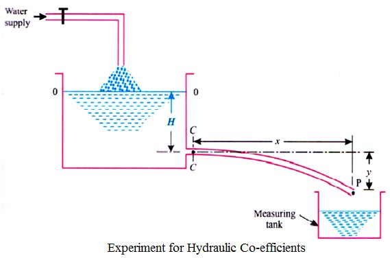
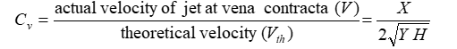
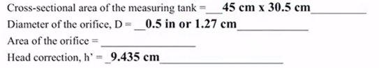
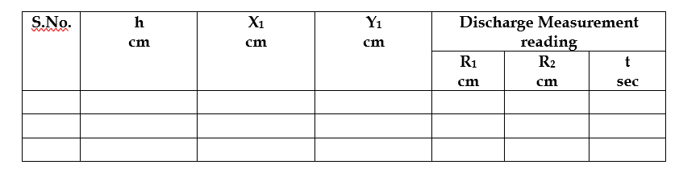
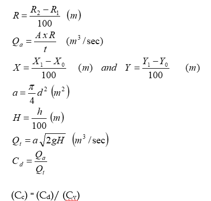

This folder has 

### Aim: 
To determine the co-efficient of discharge (Cd), co-efficient of velocity (Cv) of orifice and co-efficient of contraction(Cc).

### THEORY

Orifice is an opening or a hole of any size, shape or form through which liquid flow such that its upper edge remains below the free surface of the liquid. Orifices are used for measurement of control of flow. Orifices may have any shape but generally they are circular, square or rectangular.

When a liquid flows from a vessel or a tank, through an orifice it changes its direction. Due to this change of direction of the liquid, the jet is acted upon by lateral or side forces, which gradually reduce its area up to certain section. This area does not reduce further beyond, which the jet ceases and streamlines, first become parallel is known as the vena contracta.

### Actual Discharge (Qa): 
The water flowing through the section of a pipe or a channel under the steady state conditions is collected in a collecting tank for a known time t. The rise of water level in the collecting tank is noted down. The actual discharge is
 

### Coefficient of Discharge (Cd): 
The ratio of actual discharge (Qa) through an orifice to the theoretical discharge (Qt) is known as coefficient of discharge. It is denoted by Cd.

### Coefficient of Velocity (Cv): 
The ratio of actual velocity (V) of the jet at vena contracta to the theoretical velocity (Vth) is known as ‘coefficient of velocity’. It is denoted by Cv.

### DESCRIPTION

The set up consists of a sump tank, measuring tank and constant head tank. Orifice is provided with the set up that can be fixed at the constant head tank one at a time. Water is circulated from the sump tank through centrifugal pump. Constant heat tank and measuring tank are provided with piezometer with scale for level measurement. A measuring arrangement is provided to measure the flow pattern, through orifice, in horizontal and vertical direction. Discharge is measured by measuring tank and stop watch.

### PROCEDURE

1.	Clean the apparatus and make all tanks free from dust.
2.	Close all the valves.
3.	Fill sump tank ¾ with clean water and ensure that no foreign particles are there. 
4.	Open by-pass valve.
5.	Ensure that all On/Off switch given on the panel are at OFF position.
6.	Switch on the main power supply & switch ON the pump.
7.	Operate the flow control valve and by-pass valve to maintain the head of water in constant head tank at particular flow through orifice.
8.	Measure pointer gauge reading at the inlet and end of the jet of water, coming out from the constant head tank.
9.	Measure the flow rate of water by measuring tank and stop watch.
10.	Repeat the experiment for different water head.
11.	Repeat the experiment for different orifice.

### DATA

Area of measuring tank = 0.077 m2
Diameter of the orifice (d) = 0.015 m

### OBSERVATIONS

Initial reading of horizontal scale X0 = _0____ cm
Initial reading of vertical scale Y0 = __0___ cm
Reading on the piezometer at the level on the centre of orifice = 8 cm

### CALCULATIONS

### RESULTS

Coefficient of discharge of orifice (Cd) = ________
Coefficient of velocity of orifice (Cv) = ________
Co-efficient of contraction (Cc) = ________

### PRECAUTIONS

1.	Never run the apparatus if power supply is less than 180 volts and above 230 volts.
2.	Conduct the experiment when water gets stable.
3.	Always use clean water.
4.	To prevent clogging of moving parts, run pump at least once in a fortnight.
5.	Drain the apparatus completely after experimentation.
6.	Always keep apparatus free from dust.
