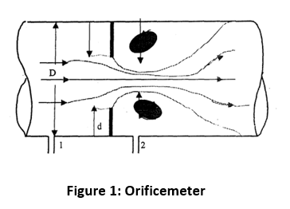
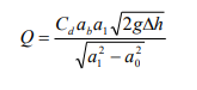

Orificemeter are devices used for measurement of rate of flow of fluid through a pipe. The basic principle on which orificemeter works is that by reducing the cross- sectional area of flow passage, a pressure difference is created and the measurement of the pressure difference enables the determination of the discharge through the pipe. An orificemeter is a cheaper arrangement for measurement of discharge through pipes and its installation requires a smaller length as compared with other flow. The opening in the form of orifice is provided at the centre of the plate. 

 

An orifice meter consists of a flat circular plate with a circular hole called orifice with is concentric with the pipe axis. The upstream face of the plate is be leveled at an angle lying between 300 and 450. The plate is clamped between the two pipe flanges with be leveled surface facing downstream. Two pressure tappings are provided one on the upstream side of plate and other on the downstream side of the orifice plate. The pressure difference exists between two sections which, can be measured by connecting a differential manometer to the two pressure taps. The discharge coefficient (Cd) can be calculated using formula:  

 

Where Cd is coefficient of orifice, a0 is cross- sectional area of orifice, a1 is cross-sectional area of pipe, g is the acceleration due to the gravity and ∆h is the difference of head in terms of water. The value of Cd, in general, depends on the shape of the orifice, d/D, location of pressure tappings (1) and (2), and the Reynolds number, Re . Since the first three parameters are fixed in an experimental set- up in a laboratory, Cd can be said to depend only on the Reynolds number. The Reynolds number is defined as equal to Vd/μ where V is the velocity of flow at tile orifice (=Q/a). I
