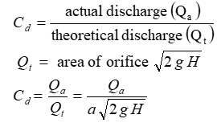

Orifice is an opening or a hole of any size, shape or form through which liquid flow such that its upper edge remains below the free surface of the liquid. Orifices are used for measurement of control of flow. Orifices may have any shape but generally they are circular, square or rectangular.  

When a liquid flows from a vessel or a tank, through an orifice it changes its direction. Due to this change of direction of the liquid, the jet is acted upon by lateral or side forces, which gradually reduce its area up to certain section. This area does not reduce further beyond, which the jet ceases and streamlines, first become parallel is known as the vena contracta.  

  

<b>Actual Discharge (Qa):</b> 
The water flowing through the section of a pipe or a channel under the steady state conditions is collected in a collecting tank for a known time t. The rise of water level in the collecting tank is noted down. The actual discharge is  
  

<b>Coefficient of Discharge (Cd):</b>  
The ratio of actual discharge (Qa) through an orifice to the theoretical discharge (Qt) is known as coefficient of discharge. It is denoted by Cd.  

  

<b>Coefficient of Velocity (Cv):</b>  
The ratio of actual velocity (V) of the jet at vena contracta to the theoretical velocity (Vth) is known as ‘coefficient of velocity’. It is denoted by Cv.  

  

<b>DESCRIPTION</b> 

The set up consists of a sump tank, measuring tank and constant head tank. Orifice is provided with the set up that can be fixed at the constant head tank one at a time. Water is circulated from the sump tank through centrifugal pump. Constant heat tank and measuring tank are provided with piezometer with scale for level measurement. A measuring arrangement is provided to measure the flow pattern, through orifice, in horizontal and vertical direction. Discharge is measured by measuring tank and stop watch.
